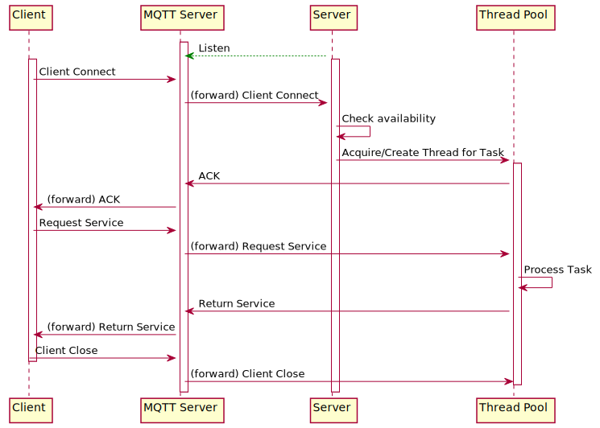

# CLI ESCAPE ROOM
```
         ==============================================
          ||     ||     ||<(.)>||<(.)>||     ||     ||
          ||     ||     ||     ||     ||     ||     ||
 _____ ___||  ___||   _ || ____||_____|| ____|| ___ ||___  __  __ 
| ____/ ___| / ___|  / \  |  _ \| ____| |  _ \ / _ \ / _ \|  \/  |
|  _| \___ \| |     / _ \ | |_) |  _|   | |_) | | | | | | | |\/| |
| |___ ___) | |___ / ___ \|  __/| |___  |  _ <| |_| | |_| | |  | |
|_____|____/ \____/_/   \_\_|   |_____| |_| \_\\___/ \___/|_|  |_|
          ||     ||     ||     ||     ||     ||     ||
          ||    _||     ||     ||     ||     ||_    ||
          ||   (__D     ||     ||     ||     C__)   ||
          ||   (__D     ||     ||     ||     C__)   ||
          ||   (__D     ||     ||     ||     C__)   ||
          ||   (__D     ||     ||     ||     C__)   ||
          ||     ||     ||     ||     ||     ||     ||
         ==============================================
```

## I. Command Line Escape Room
This is a escape room that fully runs in the command-line interface (terminal).  


escape_room/commands → Client sends player actions.
escape_room/hints → Server publishes hints and messages.
escape_room/status → Server responds with game progress and time.
Escape_room/mp_assistance → Clients in the same room can work together

## II. Architecture
<!--
```
@startuml SequenceArchitect
skinparam BackgroundColor #AliceBluegit


participant Client
participant "MQTT Server" as MqttServer
box Server
skinparam BackgroundColor grey
participant "Event Handler" as Server
participant "Thread Pool" as ThreadPool
end box

activate MqttServer

' Emphasize persistent subscription
MqttServer <--[#green]-- Server : Listen
activate Server

' Client announces its presence (optional)
activate Client
Client -> MqttServer : Client Connect
MqttServer -> Server : (forward) Client Connect
Server -> Server : Check availability

' Server receives and manages thread
Server -> ThreadPool : Acquire/Create Thread for Task
activate ThreadPool
ThreadPool -> MqttServer : ACK
MqttServer -> Client : (forward) ACK

Client -> MqttServer : Request Service
MqttServer -> ThreadPool : (forward) Request Service

ThreadPool -> ThreadPool : Process Task
ThreadPool -> MqttServer : Return Service
MqttServer -> Client : (forward) Return Service

Client -> MqttServer : Client Close
deactivate Client
MqttServer -> ThreadPool : (forward) Client Close
deactivate ThreadPool

@enduml
```
-->



## III. How-to Setup


## IV. Configuration


## V. Project Structure


## VI. MQTT Topics
### *Client-side*
#### push
- escape_room/commands?/*username → Client sends player actions.
- Escape_room/mp_assistance/*room → Clients in the same room can work together

#### subscribe
- escape_room/hints/*username → Server publishes hints and messages.
- escape_room/status/*username → Server responds with game progress and time.
- Escape_room/mp_assistance/*room → Clients in the same room can work together

### *Server-side*
#### push
- escape_room/commands!/*username → 
- escape_room/hints/*username → Server publishes hints and messages.
- escape_room/status → Server responds with game progress and time.

#### subscribe
- escape_room/commands → Server listens for new players.

*Thread*
- escape_room/commands/*username → Client sends player actions, asks for hints or status updates.


