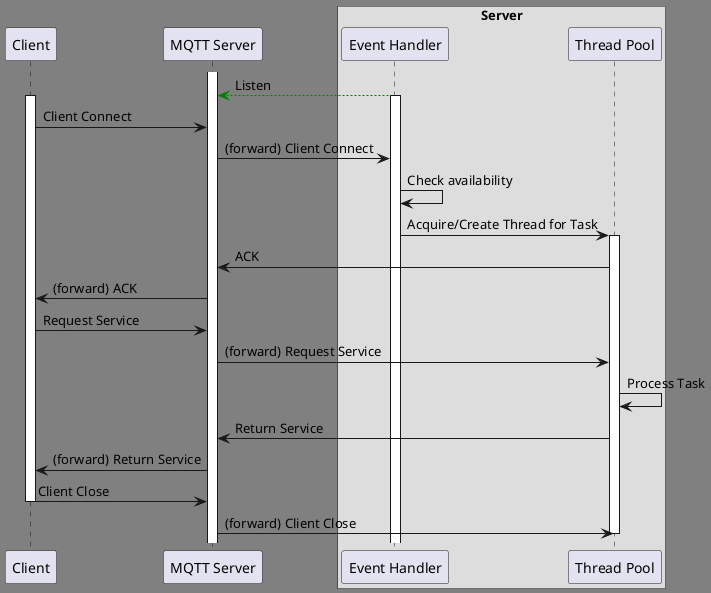
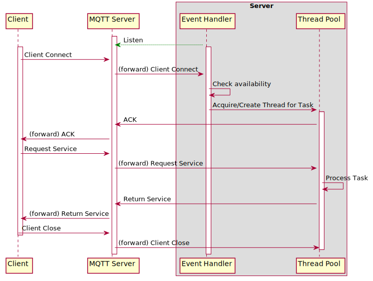
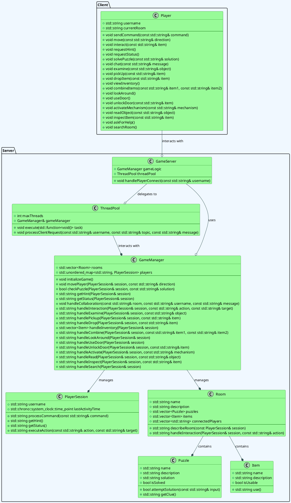
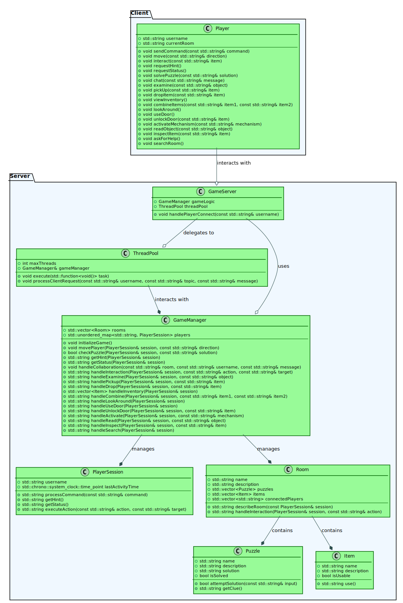

# CLI ESCAPE ROOM
```
         ==============================================
          ||     ||     ||<(.)>||<(.)>||     ||     ||
          ||     ||     ||     ||     ||     ||     ||
 _____ ___||  ___||   _ || ____||_____|| ____|| ___ ||___  __  __ 
| ____/ ___| / ___|  / \  |  _ \| ____| |  _ \ / _ \ / _ \|  \/  |
|  _| \___ \| |     / _ \ | |_) |  _|   | |_) | | | | | | | |\/| |
| |___ ___) | |___ / ___ \|  __/| |___  |  _ <| |_| | |_| | |  | |
|_____|____/ \____/_/   \_\_|   |_____| |_| \_\\___/ \___/|_|  |_|
          ||     ||     ||     ||     ||     ||     ||
          ||    _||     ||     ||     ||     ||_    ||
          ||   (__D     ||     ||     ||     C__)   ||
          ||   (__D     ||     ||     ||     C__)   ||
          ||   (__D     ||     ||     ||     C__)   ||
          ||   (__D     ||     ||     ||     C__)   ||
          ||     ||     ||     ||     ||     ||     ||
         ==============================================
```

## I. Command Line Escape Room
This is a escape room that fully runs in the command-line interface (terminal).  


escape_room/commands → Client sends player actions.
escape_room/hints → Server publishes hints and messages.
escape_room/status → Server responds with game progress and time.
Escape_room/mp_assistance → Clients in the same room can work together

## II. Architecture

### Sequence diagram
<!--

-->



### Class diagram

<!-- 

-->



## III. How-to Setup


#### Download libzmq library
1. Go to the [libzmq](https://github.com/zeromq/libzmq) GitHub page.
2. Select the v4.3.4 tag.
3. Download the repository.
4. Unzip the lib.

#### Install CMake
1. Go to [CMake](https://cmake.org/).
2. Download the Windows x64 installer.
3. Run the CMake installer.

#### Install pkg-config [Windows]
1. Go to [http://ftp.gnome.org/pub/gnome/binaries/win32/dependencies/](http://ftp.gnome.org/pub/gnome/binaries/win32/dependencies/).
2. Download the file pkg-config_0.26-1_win32.zip
3. Extract the file bin/pkg-config.exe to C:\MinGW\bin
4. Download the file gettext-runtime_0.18.1.1-2_win32.zip
5. Extract the file bin/intl.dll to C:\MinGW\bin
6. Go to [http://ftp.gnome.org/pub/gnome/binaries/win32/glib/2.28](http://ftp.gnome.org/pub/gnome/binaries/win32/glib/2.28)
7. Download the file glib_2.28.8-1_win32.zip
8. Extract the file bin/libglib-2.0-0.dll to C:\MinGW\bin

Source: https://stackoverflow.com/questions/1710922/how-to-install-pkg-config-in-windows

#### Build instructions for libzmq with MinGW
1. Run the CMake GUI.
2. Set the path to the libzmq directory as source directory.
    * e.g. C:/Users/User1/Downloads/libzmq-4.3.4
3. Set the same path as the build directory and append /build.
    * e.g. C:/Users/User1/Downloads/libzmq-4.3.4/build
4. Press the configure button.
5. CMake will ask you permission to create the build directory. Click Yes.
6. Select the MinGW Makefiles as generator for this project.
7. Click Finish
8. If the configuration is finished then deselect ZMQ_BUILD_TESTS and click Generate.
9. Run a command prompt as administrator from the build directory.
10. Enter the command `mingw32-make -j4 install` and hit enter.
11. If the build is succesful you will see that the directory C:/Program Files (x86)/ZeroMQ is created.

## IV. Configuration


## V. Project Structure


## VI. MQTT Topic Overview

### Topics per Direction

| Direction       | Topic                              | Description                               |
|----------------|-------------------------------------|-------------------------------------------|
| Client → Server | `escape_room/commands/<username>`  | Send player commands (e.g., move, solve). |
| Server → Client | `escape_room/status/<username>`    | Send room status and game info.           |
| Server → Client | `escape_room/hints/<username>`     | Server-sent hints or clues.               |
| Server → Client | `escape_room/errors/<username>`    | Error messages (e.g., invalid command).   |
| Bidirectional   | `escape_room/mp_assistance/<room>` | Chat between players in the same room.    |

## VII. Command-Line Interface API
This section is for players who use the game via the terminal. Below you can see what commands you can enter and what they do.

### Available Commands

| Action                    | Input                             | Description                                                          |
|---------------------------|-----------------------------------|----------------------------------------------------------------------|
| Move                      | `move north`                      | Move to a different room in a specific direction.                    |
| Interact                  | `use key`                         | Use an item from your inventory in the current room.                 |
| Ask for Hint              | `hint`                            | Receive a hint for your current room or situation.                   |
| Check Status              | `status`                          | Check your progress, remaining time, and current room information.   |
| Solve Puzzle              | `solve 2419`                      | Solve a puzzle by entering the correct solution.                     |
| Chat                      | `say "I found a key!"`            | Send a message to your teammates or other players in the room.       |
| Examine                   | `examine painting`                | Examine a specific object or item in the room for clues.             |
| Pick Up                   | `pick up lantern`                 | Pick up an item in the room and add it to your inventory.            |
| Drop Item                 | `drop key`                        | Drop an item from your inventory in the room.                        |
| View Inventory            | `inventory`                       | Check the items in your current inventory.                           |
| Combine Items             | `combine key with rope`           | Combine two or more items from your inventory.                       |
| Look Around               | `look around`                     | Look around your current room to gather more information.            |
| Use Door                  | `use door`                        | Attempt to open or interact with a door or entryway in the room.     |
| Unlock Door               | `unlock door with key`            | Unlock a door using an item from your inventory (e.g., a key).       |
| Activate Mechanism        | `activate lever`                  | Activate a mechanism or contraption in the room.                     |
| Read Object               | `read book`                       | Read text or instructions on an object (e.g., a book, note, etc.).   |
| Inspect Item              | `inspect key`                     | Get a description or details about an item in your inventory.        |
| Ask for Help              | `help`                            | Request a list of available commands and help with the game.         |
| Search Room               | `search room`                     | Search the entire room for hidden clues, objects, or passages.       |

### Examples

