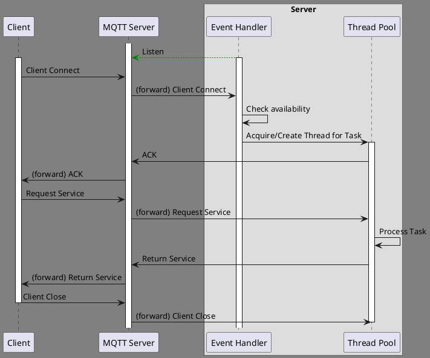
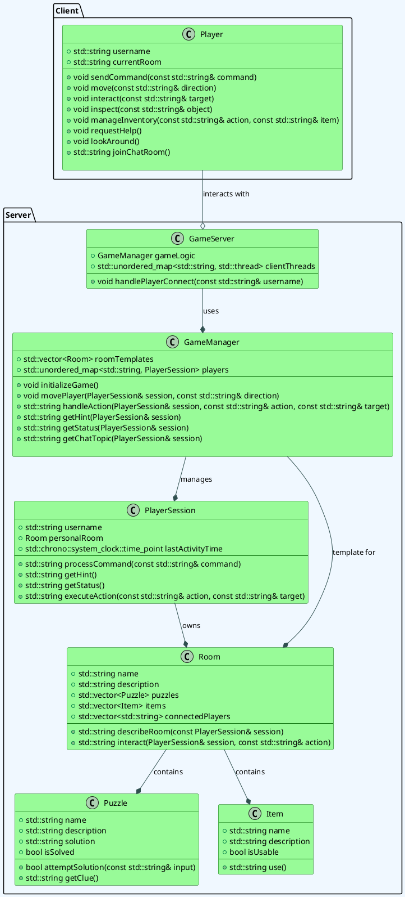

# CLI ESCAPE ROOM
```
         ==============================================
          ||     ||     ||<(.)>||<(.)>||     ||     ||
          ||     ||     ||     ||     ||     ||     ||
 _____ ___||  ___||   _ || ____||_____|| ____|| ___ ||___  __  __ 
| ____/ ___| / ___|  / \  |  _ \| ____| |  _ \ / _ \ / _ \|  \/  |
|  _| \___ \| |     / _ \ | |_) |  _|   | |_) | | | | | | | |\/| |
| |___ ___) | |___ / ___ \|  __/| |___  |  _ <| |_| | |_| | |  | |
|_____|____/ \____/_/   \_\_|   |_____| |_| \_\\___/ \___/|_|  |_|
          ||     ||     ||     ||     ||     ||     ||
          ||    _||     ||     ||     ||     ||_    ||
          ||   (__D     ||     ||     ||     C__)   ||
          ||   (__D     ||     ||     ||     C__)   ||
          ||   (__D     ||     ||     ||     C__)   ||
          ||   (__D     ||     ||     ||     C__)   ||
          ||     ||     ||     ||     ||     ||     ||
         ==============================================
```

## Overview
CLI Escape Room is a multiplayer text-based puzzle adventure that runs entirely in your terminal. Players must collaborate, explore rooms, solve puzzles, and escape before time runs out.

## 🧱 Project Structure

```
Client_app/
├── 

Server_app/
├──

```

## 🧠 Architecture

### Sequence diagram
<!--

-->


### Class diagram

<!-- 

-->


## 🔧 Setup Instructions
### Dependencies

- libzmq (ZeroMQ messaging library)
- CMake (build system)
- pkg-config (Windows-specific build support)

### Install `libzmq`

1. Visit: https://github.com/zeromq/libzmq
2. Select the v4.3.4 tag, download, and unzip.
3. Build using CMake + MinGW:
 - Open CMake GUI 
 - Source dir: path to libzmq (e.g., `C:/Users/you/libzmq-4.3.4`)
 - Build dir: same path + `/build`
 - Configure → Select *MinGW Makefiles*
 - Uncheck `ZMQ_BUILD_TESTS`
 - Generate → Open terminal in `/build` folder
 - Run: `mingw32-make -j4 install`

### Install `pkg-config` (Windows Only)
1. Download from: http://ftp.gnome.org/pub/gnome/binaries/win32/
 - `pkg-config_0.26-1_win32.zip` → extract `pkg-config.exe` to `C:\MinGW\bin`
 - `gettext-runtime_0.18.1.1-2_win32.zip` → extract `intl.dll` to `C:\MinGW\bin`
 - `glib_2.28.8-1_win32.zip` → extract `libglib-2.0-0.dll` to `C:\MinGW\bin`


## 📡 MQTT Topic Overview

| Direction       | Topic                              | Description                               |
|----------------|-------------------------------------|-------------------------------------------|
| Client → Server | `escape_room/commands/<username>`  | Send player commands (e.g., move, solve). |
| Server → Client | `escape_room/status/<username>`    | Send room status and game info.           |
| Server → Client | `escape_room/hints/<username>`     | Server-sent hints or clues.               |
| Server → Client | `escape_room/errors/<username>`    | Error messages (e.g., invalid command).   |
| Bidirectional   | `escape_room/mp_assistance/<room>` | Chat between players in the same room.    |

## 🎮 Command-Line Interface API
This section is for players who use the game via the terminal. Below you can see what commands you can enter and what they do.

### Available Commands

| Action                    | Input                             | Description                                                          |
|---------------------------|-----------------------------------|----------------------------------------------------------------------|
| Move                      | `move north`                      | Move to a different room in a specific direction.                    |
| Interact                  | `use key`                         | Use an item from your inventory in the current room.                 |
| Ask for Hint              | `hint`                            | Receive a hint for your current room or situation.                   |
| Check Status              | `status`                          | Check your progress, remaining time, and current room information.   |
| Solve Puzzle              | `solve 2419`                      | Solve a puzzle by entering the correct solution.                     |
| Chat                      | `say "I found a key!"`            | Send a message to your teammates or other players in the room.       |
| Examine                   | `examine painting`                | Examine a specific object or item in the room for clues.             |
| Pick Up                   | `pick up lantern`                 | Pick up an item in the room and add it to your inventory.            |
| Drop Item                 | `drop key`                        | Drop an item from your inventory in the room.                        |
| View Inventory            | `inventory`                       | Check the items in your current inventory.                           |
| Combine Items             | `combine key with rope`           | Combine two or more items from your inventory.                       |
| Look Around               | `look around`                     | Look around your current room to gather more information.            |
| Use Door                  | `use door`                        | Attempt to open or interact with a door or entryway in the room.     |
| Unlock Door               | `unlock door with key`            | Unlock a door using an item from your inventory (e.g., a key).       |
| Activate Mechanism        | `activate lever`                  | Activate a mechanism or contraption in the room.                     |
| Read Object               | `read book`                       | Read text or instructions on an object (e.g., a book, note, etc.).   |
| Inspect Item              | `inspect key`                     | Get a description or details about an item in your inventory.        |
| Ask for Help              | `help`                            | Request a list of available commands and help with the game.         |
| Search Room               | `search room`                     | Search the entire room for hidden clues, objects, or passages.       |

### Examples

