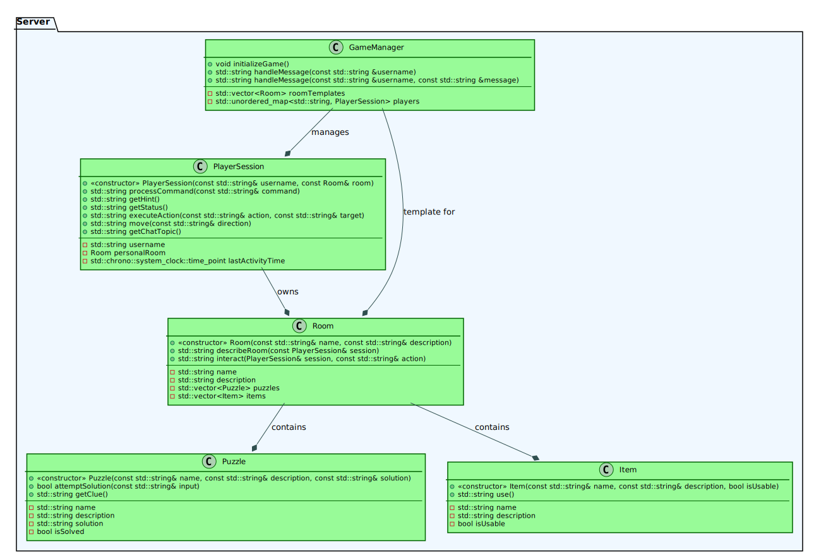

# CLI ESCAPE ROOM
```
         ==============================================
          ||     ||     ||<(.)>||<(.)>||     ||     ||
          ||     ||     ||     ||     ||     ||     ||
 _____ ___||  ___||   _ || ____||_____|| ____|| ___ ||___  __  __ 
| ____/ ___| / ___|  / \  |  _ \| ____| |  _ \ / _ \ / _ \|  \/  |
|  _| \___ \| |     / _ \ | |_) |  _|   | |_) | | | | | | | |\/| |
| |___ ___) | |___ / ___ \|  __/| |___  |  _ <| |_| | |_| | |  | |
|_____|____/ \____/_/   \_\_|   |_____| |_| \_\\___/ \___/|_|  |_|
          ||     ||     ||     ||     ||     ||     ||
          ||    _||     ||     ||     ||     ||_    ||
          ||   (__D     ||     ||     ||     C__)   ||
          ||   (__D     ||     ||     ||     C__)   ||
          ||   (__D     ||     ||     ||     C__)   ||
          ||   (__D     ||     ||     ||     C__)   ||
          ||     ||     ||     ||     ||     ||     ||
         ==============================================
```

## Overview
CLI Escape Room is a multiplayer text-based puzzle adventure that runs entirely in your terminal. Players must collaborate, explore rooms, solve puzzles, and escape before time runs out.

## 🧱 Project Structure

```
.
├── Client_app
│   ├── CMakeLists.txt
│   ├── build
│   │   ├── CMakeCache.txt
│   │   ├── CMakeFiles
│   │   ├── EscapeRoomClient -> binary file
│   │   ├── Makefile
│   │   ├── cmake_install.cmake
│   │   └── libPlayerLib.a
│   ├── include
│   │   └── Player.h
│   └── src
│       ├── Player.cpp
│       └── main.cpp
├── LICENSE
├── Readme.md
├── Server_app
│   ├── CMakeLists.txt
│   ├── build
│   │   ├── CMakeCache.txt
│   │   ├── CMakeFiles
│   │   ├── EscapeRoomServer  -> binary file
│   │   ├── Makefile
│   │   └── cmake_install.cmake
│   ├── include
│   │   ├── GameManager.h
│   │   ├── GameServer.h
│   │   ├── Item.h
│   │   ├── PlayerSession.h
│   │   ├── Puzzle.h
│   │   └── Room.h
│   └── src
│       ├── GameManager.cpp
│       ├── GameServer.cpp
│       ├── Item.cpp
│       ├── PlayerSession.cpp
│       ├── Puzzle.cpp
│       ├── Room.cpp
│       └── main.cpp
├── build_all.sh
└── docs
    ├── CppClassDiagram.svg
    └── SequenceDiagram.svg
```

## 🧠 Architecture

### Sequence diagram
<!--

-->


### Class diagram

<!-- 

-->



## 🔧 Setup Instructions
### Dependencies

- libzmq (ZeroMQ messaging library)
- CMake (build system)
- pkg-config (Windows-specific build support)

### Install `libzmq`

1. Visit: https://github.com/zeromq/libzmq
2. Select the v4.3.4 tag, download, and unzip.
3. Build using CMake + MinGW:
 - Open CMake GUI 
 - Source dir: path to libzmq (e.g., `C:/Users/you/libzmq-4.3.4`)
 - Build dir: same path + `/build`
 - Configure → Select *MinGW Makefiles*
 - Uncheck `ZMQ_BUILD_TESTS`
 - Generate → Open terminal in `/build` folder
 - Run: `mingw32-make -j4 install`

### Install `pkg-config` (Windows Only)
1. Download from: http://ftp.gnome.org/pub/gnome/binaries/win32/
 - `pkg-config_0.26-1_win32.zip` → extract `pkg-config.exe` to `C:\MinGW\bin`
 - `gettext-runtime_0.18.1.1-2_win32.zip` → extract `intl.dll` to `C:\MinGW\bin`
 - `glib_2.28.8-1_win32.zip` → extract `libglib-2.0-0.dll` to `C:\MinGW\bin`


## 📡 MQTT Topic Overview

| Direction       | Topic                              | Description                               |
|----------------|-------------------------------------|-------------------------------------------|
| Client → Server | `escape_room/commands/<username>?` | Send player commands (e.g., move, solve). |
| Server → Client | `escape_room/commands/<username>!` | Send server response                      |
| Server → Client | `escape_room/status/<username>`    | Send room status and game info.           |
| Server → Client | `escape_room/hints/<username>`     | Server-sent hints or clues.               |
| Server → Client | `escape_room/errors/<username>`    | Error messages (e.g., invalid command).   |
| Bidirectional   | `escape_room/mp_assistance/<room>` | Chat between players in the same room.    |

## 🎮 Command-Line Interface API
This section is for players who use the game via the terminal. Below you can see what commands you can enter and what they do.

### Available Commands

| Action    | Input                  | Description                            |
| --------- | ---------------------- | -------------------------------------- |
| Move      | `move room101`         | Move to a different room.              |
| Interact  | `interact with key`    | Interact with an item.                 |
| Inspect   | `inspect lantern`      | Inspect an item.                       |
| Pick Up   | `pick up lantern`      | Pick up an item.                       |
| Inventory | `view inventory`       | Check your items.                      |
| Solve     | `solve puzzle 2419`    | Solve a puzzle.                        |
| Chat      | `say "I found a key!"` | Talk to others in the chat.            |
| Search    | `search room`          | Search the room for items or clues.    |
| Hint      | `get hint`             | Get a hint for your current situation. |
| Status    | `check status`         | View your current status.              |


### Examples

